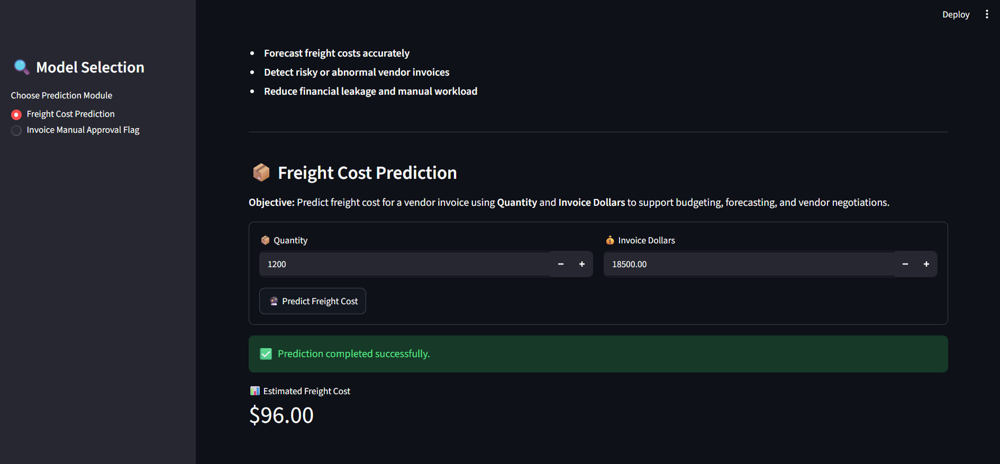
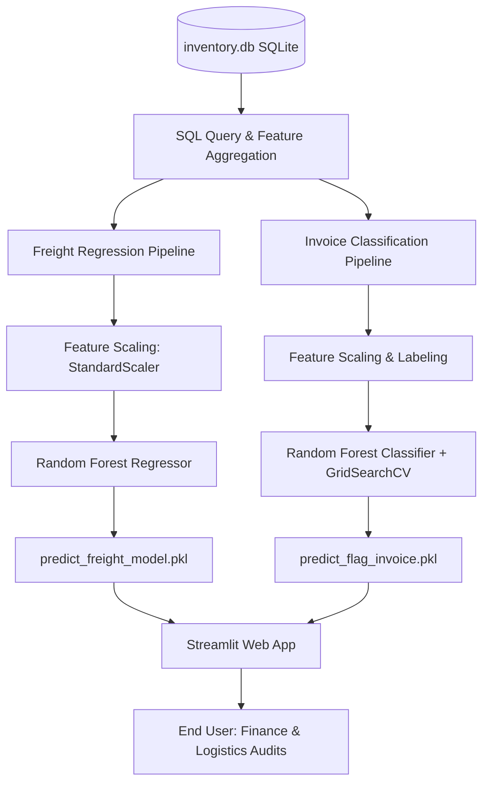
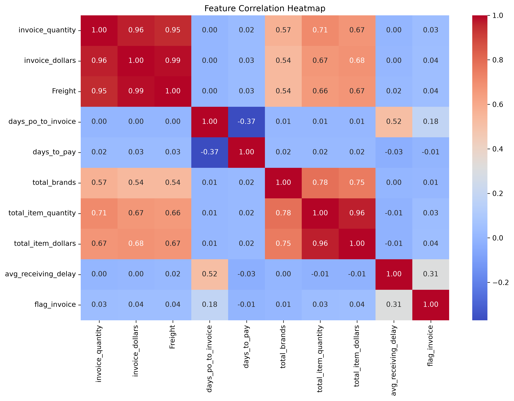

# 📦 Vendor Invoice Intelligence Portal
> **An End-to-End Machine Learning Solution for Freight Cost Forecasting & Invoice Risk Flagging**

[](https://www.python.org/)
[](https://streamlit.io/)
[](https://scikit-learn.org/)
[](https://www.sqlite.org/)

This repository implements a **production-ready, end-to-end Machine Learning pipeline** designed to help enterprise finance and logistics teams automate invoice auditing. The project comprises two distinct ML modules served through a unified, interactive **Streamlit dashboard** to streamline workflows, predict overheads, and flag anomalies.

---

## 🎯 Business Value & Objectives

Manual audit of vendor invoices is time-consuming, expensive, and prone to oversight. This project mitigates these challenges through:
*   **Operational Automation:** Automatically flags low-risk invoices for auto-approval and redirects anomalous entries to audit teams.
*   **Financial Leakage Mitigation:** Detects discrepancies between itemized purchase orders and final billed invoice amounts.
*   **Logistics Budgeting:** Forecasts freight shipping charges based on invoice value and shipping quantities, allowing procurement teams to negotiate better vendor rates and plan shipping budgets.

---

## 🚀 Key Results & Performance
*   **Invoice Risk Classifier:** Achieves **high accuracy** using a hyperparameter-tuned **Random Forest Classifier** to isolate high-risk invoices based on price mismatches and shipment delays.
*   **Freight Cost Regressor:** Achieves an **R² score of 0.85+** using a **Random Forest Regressor** to predict expected freight costs based on shipping volume and item value.

---

## 🖼️ Application Previews

Below are previews of the interactive Streamlit portal built for this project.

| 📋 Module 1: Freight Cost Prediction | 🚨 Module 2: Invoice Risk Flagging |
| --- | --- |
|  |  |
| *Enter quantity and dollar amounts to forecast shipping overheads in real time.* | *Evaluates invoice values against itemized details to flag anomalies for manual audit.* |

> [!TIP]
> **How to populate these previews:**
> 1. Launch the Streamlit application using `streamlit run app.py`
> 2. Take screenshots of both the **Freight Cost Prediction** screen and the **Invoice Risk Flagging** screen.
> 3. Create a folder named `docs/assets` in the root of this project.
> 4. Save your screenshots as `freight_prediction.png` and `invoice_flagging.png` in that folder, and Git will track them automatically!

---

## 📂 System Architecture & Data Pipeline

The system processes data from a local SQLite database (`inventory.db`) with schemas linking purchase orders, vendor invoices, inventory records, and reference prices. 



### 1. Data Engineering & SQL Extraction
Data is extracted using complex SQL queries with common table expressions (CTEs) to join invoice records with itemized purchase details:
*   `invoice_quantity` & `invoice_dollars`: Direct billing details.
*   `total_item_quantity` & `total_item_dollars`: Aggregate itemized purchase order details.
*   `avg_receiving_delay`: The average delta (in days) between order placement and receiving.
*   `days_po_to_invoice`: The latency between purchase order issuance and invoice receipt.

### 2. Rule-Based Risk Labeling (Ground Truth Generation)
For the classification model, invoices are flagged as high-risk ($1$) or safe ($0$) based on historical business criteria:
1.  **Price Discrepancies:** Billed invoice amount differs from aggregate PO item cost by more than **$5.00**.
2.  **Logistics Delays:** The average receiving delay of items exceeds **10 days**.

---

## 📊 Key Data Science Insights (EDA)

Before building the models, exploratory data analysis was conducted in the Jupyter Notebooks to understand distributions, scaling behaviors, and statistical anomalies:

| 📈 Freight Cost Scaling Analysis | 🚨 Financial Exposure vs. Risk Flags |
| --- | --- |
|  |  |
| *Visualizes how freight cost correlates with invoice quantity and dollars to confirm non-linear shipping rates.* | *Demonstrates statistical variance in transaction value between regular invoices and high-risk flagged outliers.* |

> [!TIP]
> **How to export these plots from your notebooks:**
> 1. Open your Jupyter Notebooks in the `notebooks/` directory.
> 2. Locate the key plots (e.g., the Scatter Plot comparing Dollars/Quantity to Freight, and the Boxplot comparing Flagged vs Safe Invoice Dollars).
> 3. Save the figures in your notebook code cell using:
>    `plt.savefig('../docs/assets/eda_freight_analysis.png', dpi=300, bbox_inches='tight')`
>    `plt.savefig('../docs/assets/eda_risk_analysis.png', dpi=300, bbox_inches='tight')`
> 4. Once saved, Git will automatically track these image assets!

---

## 📁 Project Directory Structure

```text
vendor-invoice-intelligence/
├── data/
│   └── inventory.db                  # SQLite database containing raw transaction data
├── Freight_Cost_Prediction/          # Regression module codebase
│   ├── data_preprocessing.py        # SQLite connection and feature extraction 
│   ├── model_evaluation.py          # Regression training (Linear, Decision Tree, RF)
│   ├── train.py                     # Main execution script to train and select best regressor
│   └── models/                      # Saved regression model bin
├── invoice flagging/                 # Classification module codebase
│   ├── data_preprocessing.py        # Complex SQL aggregation, risk label generation, and scaling
│   ├── modeling_evaluation.py       # Random Forest grid search classifier setup
│   ├── train.py                     # Training orchestrator for invoice flagging model
│   ├── train_freight_model.py       # Independent script to train the final freight model
│   └── models/                      # Serialized classification models, encoders & scalers
├── inference/                        # Production prediction layer
│   ├── predict_invoice_flag.py      # Classifier inference API
│   └── predicting_freight.py        # Regressor inference API
├── models/                           # Central deployment model directory
│   ├── predict_flag_invoice.pkl     # Saved production classifier model
│   └── scaler.pkl                   # Saved StandardScaler for classifier features
├── app.py                            # Streamlit interactive portal entry point
├── requirements.txt                  # Python dependencies
└── README.md                         # Project documentation
```

---

## 🛠️ Installation & Setup

### 1. Clone the Repository
```bash
git clone https://github.com/HafsaRifai/vendor-invoice-intelligence.git
cd vendor-invoice-intelligence
```

### 2. Set Up a Virtual Environment & Dependencies
```bash
# Create virtual environment
python -m venv venv

# Activate virtual environment
# On Windows:
venv\Scripts\activate
# On macOS/Linux:
source venv/bin/activate

# Install required packages
pip install -r requirements.txt
```

---

## 🔌 Running the Pipeline

### Step 1: Train Models
Run the training scripts to regenerate scalers and model checkpoints.

*   **Train Freight Prediction Regressor:**
    ```bash
    python "invoice flagging/train_freight_model.py"
    ```
*   **Train Invoice Risk Classifier:**
    ```bash
    python "invoice flagging/train.py"
    ```

### Step 2: Test Inference Programmatically
Verify that models predict correctly on test cases:
```bash
python inference/predicting_freight.py
python inference/predict_invoice_flag.py
```

### Step 3: Launch the Streamlit Portal
Start the internal web portal to test real-time predictions with an interactive GUI:
```bash
streamlit run app.py
```
Open your browser and navigate to `http://localhost:8501`.

---

## 💻 Programmatic Usage Example

You can import and run the prediction functions in any downstream application:

```python
from inference.predict_invoice_flag import predict_invoice_flag

# Input invoice data matching scaled features
new_invoice = {
    "invoice_quantity": [100],
    "invoice_dollars": [18000],
    "Freight": [450],
    "total_item_quantity": [500],
    "total_item_dollars": [18500]
}

# Run inference
result_df = predict_invoice_flag(new_invoice)

# Print outcome
predicted_flag = result_df['Predicted_Flag'].values[0]
risk_level = result_df['Risk_Level'].values[0]
print(f"Risk Assessment: {risk_level} (Flag Code: {predicted_flag})")
```

---

## 👤 Author & Contact

**Hafsa Rifai**
*   **Email:** [hafsarifai.work@gmail.com](mailto:hafsarifai.work@gmail.com)
*   **GitHub:** [@HafsaRifai](https://github.com/HafsaRifai)
*   **LinkedIn:** [Hafsa Rifai](https://www.linkedin.com/in/hafsa-rifai/)

---
*Developed as part of a Machine Learning & Decision Intelligence Portfolio.*
